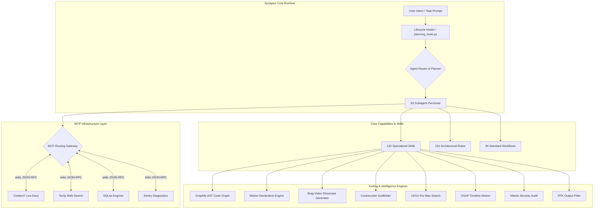

# Synaptor

[](https://github.com/xayakster/Synaptor/actions/workflows/ci.yml)
[](LICENSE)
[](https://www.python.org/)
[](https://nodejs.org/)
[](tests/)
[](SECURITY.md)

**Synaptor** is an autonomous, multi-agent neural development infrastructure designed for AI-assisted coding assistants (Claude Code, Google Antigravity, Cursor, Copilot CLI, Gemini, Codex).

By combining neural routing, persistent working memory on disk, live AST codebase intelligence, declarative UI motion, automated video showcase generation, live documentation search, and multi-domain engineering tools, Synaptor turns any AI coding assistant into a coordinated team of 63 specialized software developers.

---

## 🚀 Key Features

- **63 Specialized Subagents**: Dedicated personas for every stage of development (e.g., `tdd-guide`, `security-reviewer`, `architect`, `planner`, `code-reviewer`, `build-error-resolver`, `e2e-runner`).
- **132 Extensible Skills**: Production-ready skills covering full-stack development, API design, database migrations, security audits, AI evaluations, AST knowledge graphs, declarative UI motion, and video trailers.
- **Graphify Codebase Intelligence**: AST-powered knowledge graph engine with community clustering, interactive visual D3 explorer, and **mandatory automatic freshness updates** upon noticeable codebase changes.
- **Motion Declarative Animation**: Spring physics, layout morphs (`layoutId`), unmount transitions (`AnimatePresence`), gestures, and accessibility controls for React (`motion/react`), Vue (`motion/vue`), and DOM.
- **Brag Project Showcase Engine**: Automated developer video scripts, structured multi-scene storyboards, and local video rendering with strict privacy controls.
- **Model Context Protocol (MCP)**: Native stdio JSON-RPC integration featuring live documentation search with **Context7**, web search with **Tavily**, local databases with **SQLite**, and error diagnostics with **Sentry**.
- **Planning with Files (`PWF`)**: Persistent working memory system (`task_plan.md`, `findings.md`, `progress.md`) enabling long-running autonomous workflows across context loss and session restarts.
- **Project Scaffolding Engine**: Cookiecutter-compatible zero-dependency generator (`.agents/tools/cookiecutter/project_scaffold.py`) for instantaneous full-stack project initialization.
- **UI/UX Pro Max Intelligence**: High-performance design search engine with indexed style catalogs and design system templates.
- **GSAP Motion & Animation**: Presets, timing curves, and framework-specific patterns for complex timeline-driven and canvas animations.
- **Mantis Security Suite**: Autonomous security verification, threat modeling, and invariant validation architecture.
- **RTK Token Compression**: CLI proxy engine optimizing terminal command outputs by 60–90% to conserve model context.
- **Universal Lifecycle Hooks**: Event-driven contextual injection on `SessionStart`, `UserPromptSubmit`, and `PreCompact`.

---

## 🏗 Architecture Overview



---

## 📁 Repository Structure

```text
.
├── .agents/
│   ├── agents/         # 63 Specialized Subagent Personas (tdd-guide, planner, etc.)
│   ├── skills/         # 132 Production Domain Skills (each with SKILL.md)
│   ├── rules/          # 131 Architecture, Quality & Coding Rules (Graphify, Motion, Brag)
│   ├── workflows/      # 94 Standard Operational Workflows
│   ├── hooks/          # Lifecycle Event Handlers & Platform Wrappers
│   ├── tools/          # Integrated Tooling (Graphify, Brag, Mantis, Cookiecutter, GSAP, RTK)
│   ├── config/         # MCP Configs, Server Registry & Motion/GSAP Presets
│   ├── templates/      # Project Scaffolding Templates
│   ├── manifest.json   # Machine-Readable System Manifest (18 Upstream Repos)
│   └── MANIFEST.md     # Architectural Catalog & Changelog
├── .github/
│   └── workflows/      # GitHub Actions CI Automation
├── scripts/            # Cross-Platform Automation & Health Check Scripts
│   ├── bootstrap-agent-environment.py # One-Command Environment Initializer
│   ├── mcp-health-check.py            # Live MCP stdio Verification
│   └── security-audit-scan.py         # Static Security & Secret Scanner
├── tests/              # Comprehensive Automated Pytest Suite (40+ Tests)
├── .env.example        # Clean Environment Variable Template
├── .gitignore          # Production-Grade Multi-Category Ignore Rules
├── LICENSE             # MIT License
└── README.md           # Developer & Platform Documentation
```

---

## ⚡ Quick Start

### 1. Prerequisites
- **Python**: `3.10` or higher
- **Node.js**: `18.x`, `20.x`, or `22.x`
- **Git**: `2.30+`

### 2. Installation & Bootstrap

Clone the repository and initialize the agent environment:

```bash
git clone https://github.com/xayakster/Synaptor.git
cd Synaptor

# Run automated bootstrap
python scripts/bootstrap-agent-environment.py
```

### 3. Verify System Health

Run the automated MCP health check, Graphify status, and security audit scanner:

```bash
# Verify Model Context Protocol (MCP) servers
python scripts/mcp-health-check.py

# Check Graphify codebase graph
python .agents/tools/graphify/graphify_runner.py . --status

# Run continuous security and secret scan
python scripts/security-audit-scan.py
```

---

## 🧪 Testing

The repository includes a comprehensive automated test suite covering all 18 integrated subsystems, MCP bridges, Graphify AST runner, Motion presets, Brag preflight, project scaffolding, and security invariants.

```bash
# Run full automated test suite
pytest -v tests/
```

All automated tests execute in under 15 seconds with 100% pass guarantee.

---

## 🔒 Security & Privacy

- **Zero Hardcoded Credentials**: Source code and configuration templates contain strictly zero plaintext secrets.
- **Local Stdio Isolation**: MCP servers communicate locally over standard I/O child processes without external socket exposure.
- **Local-First Media & Code Intelligence**: Graphify and Brag run 100% locally with zero external uploads.
- **Automated Security Gates**: All pull requests and commits are verified using `scripts/security-audit-scan.py` to prevent credential leakage.
- **Strict Data Redaction**: Diagnostics and logs automatically mask high-entropy strings (e.g., `sk-************ABCD`).

For vulnerability reporting guidelines, see [SECURITY.md](SECURITY.md).

---

## 📄 License

This project is licensed under the terms of the [MIT License](LICENSE).
